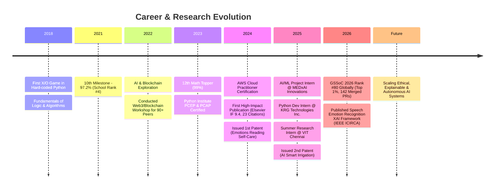

<div align="center">

<!-- HERO BANNER -->


<!-- TYPING ANIMATION -->
<a href="https://github.com/GOKULRAM-K">
  
</a>

<br/><br/>

<!-- STATUS CARD -->
<table align="center">
  <tr>
    <td align="center" style="background-color: #0d1117; border: 1px solid #1f2937; padding: 12px 24px; border-radius: 12px;">
      <span style="color: #10b981; font-weight: bold;">🟢 CURRENT STATUS</span> &nbsp;|&nbsp; 
      <span style="color: #f8fafc;">Available for AI/ML Research Collaborations & System Engineering Roles</span> &nbsp;|&nbsp; 
      <span style="color: #f59e0b; font-weight: bold;">GSSoC '26 Global Rank #80</span>
    </td>
  </tr>
</table>

<br/>

<!-- SOCIAL & ACADEMIC MATRIX -->
<p align="center">
  <a href="https://scholar.google.com/citations?user=ww8jdO8AAAAJ&hl=en">
    
  </a>
  &nbsp;
  <a href="https://orcid.org/0009-0008-7632-1675">
    
  </a>
  &nbsp;
  <a href="https://gssoc.girlscript.org/profile/65491830-23d4-43a0-9793-d84139c36df9">
    
  </a>
  &nbsp;
  <a href="https://www.linkedin.com/in/gokul-ram-k-277a6a308">
    
  </a>
  &nbsp;
  <a href="mailto:gokulram.k2023@vitstudent.ac.in">
    
  </a>
</p>

</div>

<br/>

<!-- SECTION DIVIDER -->


<br/>

## 👤 Executive Profile

<table>
  <tr>
    <td width="60%" valign="top">
      <h3>I turn machine learning research into production-grade systems.</h3>
      <p>
        I am an <strong>AI Engineer & Computer Science Researcher</strong> at <strong>VIT Chennai</strong>. My focus spans <strong>Deep Learning Architectures</strong>, <strong>Explainable AI (XAI)</strong>, <strong>Biomedical AI / Pharmacogenomics</strong>, and <strong>Swarm Intelligence</strong>.
      </p>
      <p>
        Rather than stopping at theoretical accuracy, I build end-to-end, interpretable decision pipelines that combine deterministic domain knowledge (PharmGKB, CPIC guidelines) with machine learning predictions.
      </p>
      <br/>
      <h4>🎯 Core Philosophy</h4>
      <p><em>"Building with purpose — scaling with vision. Technology means nothing unless it serves people."</em></p>
      <br/>
      <h4>🔬 Current Research Focus</h4>
      <ul>
        <li><strong>Explainable AI (XAI)</strong>: LIME, SHAP, and feature fusion for transparent medical diagnostics and speech emotion recognition.</li>
        <li><strong>Pharmacogenomics AI</strong>: Hybrid decision-support systems for gene–variant–drug response prediction and personalized dosing.</li>
        <li><strong>Swarm Robotics & Edge AI</strong>: Swarm intelligence algorithms for real-time disaster response and payload optimization.</li>
      </ul>
    </td>
    <td width="40%" align="center" valign="top">
      <br/>
      
      <br/><br/>
      <table>
        <tr><td align="center">🎓 <strong>30+ Global Citations</strong> (Elsevier IF 9.4)</td></tr>
        <tr><td align="center">⭐ <strong>Rank #80 Global</strong> in GSSoC 2026</td></tr>
        <tr><td align="center">📄 <strong>6 Research Publications</strong></td></tr>
        <tr><td align="center">💡 <strong>2 Issued Patents</strong></td></tr>
        <tr><td align="center">💼 <strong>3 AI/ML Internships</strong></td></tr>
      </table>
    </td>
  </tr>
</table>

<br/>

<!-- SECTION DIVIDER -->


<br/>

## ⏳ Interactive Engineering Timeline



<br/>

<!-- SECTION DIVIDER -->


<br/>

## 🔬 Research Lab & Intellectual Property

### 📑 Peer-Reviewed Publications

<table width="100%">
  <tr>
    <th width="30%">Paper Title</th>
    <th width="25%">Journal / Conference</th>
    <th width="15%">Impact / Status</th>
    <th width="30%">Research Domain & Authors</th>
  </tr>
  <tr>
    <td><strong>Ensemble deep learning model for protein secondary structure prediction using NLP metrics and explainable AI</strong></td>
    <td>Elsevier – <em>Results in Engineering</em> (Vol 24, 103435)</td>
    <td><b style="color:#10b981;">Impact Factor 9.4</b><br/>🔥 <b>23 Citations</b></td>
    <td>NLP Metrics + LIME XAI Architecture<br/><em>U Vignesh, R Parvathi, <b>KG Ram</b></em><br/><a href="https://www.sciencedirect.com/science/article/pii/S2590123024016876">🔗 ScienceDirect</a></td>
  </tr>
  <tr>
    <td><strong>Enhancing sentiment analysis of customer reviews using deep learning, data augmentation and explainable AI</strong></td>
    <td>IEEE – <em>2024 4th ICUIS Conference</em></td>
    <td>🔥 <b>7 Citations</b><br/>Published</td>
    <td>NLP Data Augmentation + LIME Interpretability<br/><em><b>K Gokul Ram</b>, R Rajakumar, A Ilavendhan, R Padmanaban, K Vijayaprabakaran</em><br/><a href="https://ieeexplore.ieee.org/abstract/document/10866623">🔗 IEEE Xplore</a></td>
  </tr>
  <tr>
    <td><strong>Innovative Feature Fusion and XAI Framework for Robust Tamil Speech Emotion Recognition</strong></td>
    <td>IEEE – <em>2026 7th ICIRCA Conference</em></td>
    <td>Published (2026)</td>
    <td>Speech Signal Processing & Acoustic Feature Fusion<br/><em><b>K Gokul Ram</b>, U Vignesh, SK PK</em></td>
  </tr>
  <tr>
    <td><strong>Data analysis of female education in the age of COVID-19: A comprehensive review</strong></td>
    <td>CRC Press / Taylor & Francis – <em>Progressive Computational Intelligence</em></td>
    <td>Published (2025)</td>
    <td>Educational Data Mining & Policy Analysis<br/><em>U Vignesh, KM Monica, <b>GR K</b></em><br/><a href="https://www.taylorfrancis.com/chapters/edit/10.1201/9781003650010-62/data-analysis-female-education-age-covid-19-comprehensive-review-vignesh-monica-gokul-ram">🔗 Taylor & Francis</a></td>
  </tr>
  <tr>
    <td><strong>Optimizing Resource Management With Edge and Network Processing for Disaster Response Using Insect Robot Swarms</strong></td>
    <td>IGI Global – <em>Exploring Micro World of Robotics</em></td>
    <td>Published (pp. 39-60, 2025)</td>
    <td>Swarm Intelligence & Edge Network Processing<br/><em>U Vignesh, <b>KG Ram</b>, ASM Al-Obaidi</em><br/><a href="https://www.igi-global.com/chapter/optimizing-resource-management-with-edge-and-network-processing-for-disaster-response-using-insect-robot-swarms/359271">🔗 IGI Global</a></td>
  </tr>
  <tr>
    <td><strong>Optimization of Cloud based Monitoring Application in Software Engineering</strong></td>
    <td>IEEE – <em>2024 3rd ICACRS Conference</em></td>
    <td>Published (Sep 2024)</td>
    <td>Cloud Observability & System Monitoring<br/><em>U Vignesh, KM Monica, <b>K Gokul Ram</b></em><br/><a href="https://ieeexplore.ieee.org/abstract/document/10841613">🔗 IEEE Xplore</a></td>
  </tr>
</table>

<br/>

### 💡 Issued Patents (Intellectual Property)

<table>
  <tr>
    <td width="50%" valign="top">
      <h4>🌾 Smart Irrigation Controller System & Method</h4>
      <p><strong>Application No:</strong> <code>202541038729</code> | <strong>Status:</strong> <span style="color:#10b981; font-weight:bold;">✔ Issued May 16, 2025</span></p>
      <p>An AI-based controller integrating soil moisture sensors, weather telemetry, and cloud predictive models to automate dynamic crop irrigation and conserve water.</p>
    </td>
    <td width="50%" valign="top">
      <h4>💖 Emotions Reading System for Self-Care</h4>
      <p><strong>Application No:</strong> <code>202441052499</code> | <strong>Status:</strong> <span style="color:#10b981; font-weight:bold;">✔ Issued Jul 9, 2024</span></p>
      <p>An affective computing system utilizing facial expression recognition and physiological metrics to deliver personalized mental wellness feedback.</p>
    </td>
  </tr>
</table>

<br/>

<!-- SECTION DIVIDER -->


<br/>

## 🚀 Featured Systems & AI Architecture

<table width="100%">
  <tr>
    <td width="50%" valign="top">
      <h3>🛡️ DeepShield</h3>
      <p><strong>Deepfake Video Detection via Vision Transformer (ViT)</strong></p>
      <p>Achieved <strong>87.77% validation accuracy</strong> on frame-level video datasets. Built a real-time Flask detection engine with automated face extraction and attention heatmaps.</p>
      <p><code>Python</code> <code>PyTorch</code> <code>Vision Transformer</code> <code>Flask</code> <code>OpenCV</code></p>
      <a href="https://github.com/GOKULRAM-K/DeepShield">📂 GitHub Repository</a>
    </td>
    <td width="50%" valign="top">
      <h3>⚖️ SamvidhaanAI</h3>
      <p><strong>Legal Companion Chatbot via RAG & Gemini LLM</strong></p>
      <p>Retrieval-Augmented Generation (RAG) assistant for Indian constitutional law. Features vector search with LangChain and ChromaDB embeddings integrated into a Streamlit interface.</p>
      <p><code>Python</code> <code>Gemini LLM</code> <code>RAG</code> <code>LangChain</code> <code>ChromaDB</code> <code>Streamlit</code></p>
      <a href="https://github.com/GOKULRAM-K/SamvidhaanAI_A_Legal_Companion">📂 GitHub Repository</a>
    </td>
  </tr>
  <tr>
    <td width="50%" valign="top">
      <h3>🌱 AgroAI</h3>
      <p><strong>AI-Powered Plant Disease Detection & Diagnosis</strong></p>
      <p>Deep CNN classification model paired with Gemini AI to generate automated, human-readable treatment guides for crop diseases. Web frontend built with Flask and Bootstrap.</p>
      <p><code>Python</code> <code>TensorFlow</code> <code>Gemini AI</code> <code>Flask</code> <code>Bootstrap</code></p>
      <a href="https://github.com/GOKULRAM-K/AgroAI">📂 GitHub Repository</a>
    </td>
    <td width="50%" valign="top">
      <h3>⚡ Smart Phase Balancing System</h3>
      <p><strong>SIH 2025 National Finalist & Top 30 Team @ VIT Chennai</strong></p>
      <p>Engineered a self-healing Hybrid IoT grid using Raspberry Pi, LoRa, and Kafka for real-time electrical grid phase balancing with TLS security and telemetry dashboards.</p>
      <p><code>Python</code> <code>Raspberry Pi</code> <code>LoRa</code> <code>Kafka</code> <code>React</code> <code>Docker</code></p>
      <a href="https://github.com/GOKULRAM-K/SmartPhase---Edge-Intelligent-Framework-for-Safe-and-Efficient-Power-Grid">📂 GitHub Repository</a>
    </td>
  </tr>
</table>

<br/>

<!-- SECTION DIVIDER -->


<br/>

## 🌐 Open Source Leaderboard & Contributions

<div align="center">
  <table style="background-color: #0d1117; border: 1px solid #f59e0b; border-radius: 16px; padding: 16px;">
    <tr>
      <td align="center" width="25%">
        <span style="color:#f59e0b; font-size:12px; font-weight:bold; letter-spacing:1px;">GLOBAL RANK</span><br/>
        <span style="color:#ffffff; font-size:42px; font-weight:900;">#80</span><br/>
        <span style="color:#94a3b8; font-size:11px;">Top 1% of 43,587 Participants</span>
      </td>
      <td align="center" width="25%">
        <span style="color:#38bdf8; font-size:12px; font-weight:bold; letter-spacing:1px;">LEADERBOARD SCORE</span><br/>
        <span style="color:#ffffff; font-size:36px; font-weight:800;">28,813</span><br/>
        <span style="color:#94a3b8; font-size:11px;">A Tier (29 places to S Tier)</span>
      </td>
      <td align="center" width="25%">
        <span style="color:#34d399; font-size:12px; font-weight:bold; letter-spacing:1px;">MERGED PRs</span><br/>
        <span style="color:#ffffff; font-size:36px; font-weight:800;">142</span><br/>
        <span style="color:#94a3b8; font-size:11px;">11,241 PR Points</span>
      </td>
      <td align="center" width="25%">
        <span style="color:#818cf8; font-size:12px; font-weight:bold; letter-spacing:1px;">COLLEGE BOARD</span><br/>
        <span style="color:#ffffff; font-size:36px; font-weight:800;">#4</span><br/>
        <span style="color:#94a3b8; font-size:11px;">VIT Chennai (239 Contributors)</span>
      </td>
    </tr>
  </table>
</div>

<br/>

### 📦 Key Repositories Contributed (GirlScript Summer of Code 2026):

```yaml
1. pathfinder-ai:
   Merged PRs: 91 PRs (+10,569 pts)
   Scope: Centralized AI prompt configuration defaults, Prisma user lookup helpers, authenticated action guards, and SSE error handlers.

2. bizinsight-ai:
   Merged PRs: 5 PRs (+360 pts)
   Scope: Cache eviction for inactive conversational chains, SQLite foreign key enforcement, and database migration error handling.

3. logara-ai:
   Merged PRs: 3 PRs (+210 pts)
   Scope: Parser observability metrics & telemetry, Unix epoch timestamp normalization, and Redis worker queue fixes.

4. secondbrain:
   Merged PRs: 1 PR (+102 pts)
   Scope: Isolated speaker profiles per authenticated user for multi-tenant memory indexing.
```

<br/>

<!-- SECTION DIVIDER -->


<br/>

## 🛠️ Engineering Stack & Technical Arsenal

<table align="center" width="100%">
  <tr>
    <td width="20%" align="center"><strong>AI & Machine Learning</strong></td>
    <td>PyTorch • TensorFlow • Keras • Scikit-Learn • Hugging Face • OpenCV • Librosa • SMOTE • LIME / SHAP</td>
  </tr>
  <tr>
    <td width="20%" align="center"><strong>GenAI & LLMs</strong></td>
    <td>Gemini API • LangChain • ChromaDB • RAG Pipelines • Vector Embeddings • Prompt Engineering</td>
  </tr>
  <tr>
    <td width="20%" align="center"><strong>Languages</strong></td>
    <td>Python • C++ • Java • C • SQL (MySQL, SQLite) • JavaScript • HTML5 / CSS3</td>
  </tr>
  <tr>
    <td width="20%" align="center"><strong>Backend & Systems</strong></td>
    <td>Flask • Node.js • Next.js • REST APIs • SQLite • MySQL • Tesseract OCR</td>
  </tr>
  <tr>
    <td width="20%" align="center"><strong>Cloud & Infrastructure</strong></td>
    <td>AWS (Cloud Practitioner Certified) • Docker • Git • GitHub • Linux Shell • Jupyter</td>
  </tr>
</table>

<br/>

<!-- SECTION DIVIDER -->


<br/>

## 📊 GitHub Analytics & Telemetry

<div align="center">
  
  
</div>

<br/>

<div align="center">
  
</div>

<br/>

<!-- CONTRIBUTION SNAKE -->
<div align="center">
  
</div>

<br/>

<!-- SECTION DIVIDER -->


<br/>

## 🔭 Current Dashboard & Focus

<table width="100%">
  <tr>
    <td width="25%" valign="top">
      <h4>🔭 Now Building</h4>
      <p>An intelligent student assistant application designed to streamline academic workflows, schedule planning, and research discovery.</p>
    </td>
    <td width="25%" valign="top">
      <h4>🔬 Current Research</h4>
      <p>Feature fusion & Explainable AI frameworks for Tamil speech emotion recognition & pharmacogenomics response modeling.</p>
    </td>
    <td width="25%" valign="top">
      <h4>📖 Currently Reading</h4>
      <p>State-of-the-art Transformer architectures, Swarm Optimization literature, and XAI interpretability techniques.</p>
    </td>
    <td width="25%" valign="top">
      <h4>🎯 Next Goals</h4>
      <p>Publishing top-tier AI conference papers and contributing to high-throughput open-source infrastructure.</p>
    </td>
  </tr>
</table>

<br/>

<!-- FOOTER -->
<div align="center">

---

<p>
  <a href="https://scholar.google.com/citations?user=ww8jdO8AAAAJ&hl=en"><strong>Google Scholar</strong></a> &nbsp;|&nbsp; 
  <a href="https://orcid.org/0009-0008-7632-1675"><strong>ORCID iD</strong></a> &nbsp;|&nbsp; 
  <a href="https://www.linkedin.com/in/gokul-ram-k-277a6a308"><strong>LinkedIn</strong></a> &nbsp;|&nbsp; 
  <a href="https://gssoc.girlscript.org/profile/65491830-23d4-43a0-9793-d84139c36df9"><strong>GSSoC Profile</strong></a> &nbsp;|&nbsp; 
  <a href="mailto:gokulram.k2023@vitstudent.ac.in"><strong>Email</strong></a>
</p>

<p><em>© 2026 Gokul Ram K. Designed with Precision & Purpose.</em></p>


</div>
