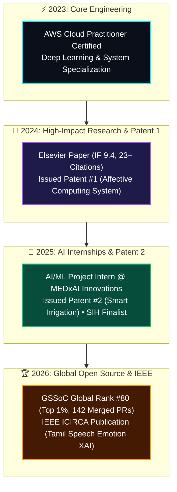

<!-- HERO BANNER -->

<!-- TYPING ANIMATION -->

  

<!-- VIBRANT STATUS & METRICS BADGES -->

  
  &nbsp;
  
  &nbsp;
  

<!-- SOCIAL & ACADEMIC MATRIX -->

  
  &nbsp;
  
  &nbsp;
  
  &nbsp;
  
  &nbsp;
  

 

<!-- COLOURFUL MAC TERMINAL -->

<table width="92%" style="background-color: #080c14; border: 2px solid #00F5FF; border-radius: 12px; border-collapse: separate; border-spacing: 0; box-shadow: 0 10px 30px rgba(0, 245, 255, 0.25);">
  <tr>
    <td style="background-color: #161b22; padding: 12px 16px; border-top-left-radius: 10px; border-top-right-radius: 10px; border-bottom: 1px solid #30363d;">
      <svg width="14" height="14" viewBox="0 0 14 14" style="vertical-align: middle;"><circle cx="7" cy="7" r="6" fill="#FF5F56"/></svg>&nbsp;
      <svg width="14" height="14" viewBox="0 0 14 14" style="vertical-align: middle;"><circle cx="7" cy="7" r="6" fill="#FFBD2E"/></svg>&nbsp;
      <svg width="14" height="14" viewBox="0 0 14 14" style="vertical-align: middle;"><circle cx="7" cy="7" r="6" fill="#27C93F"/></svg>&nbsp;&nbsp;&nbsp;
      gokulram@ai-engine:~ (system_core.py)
    </td>
  </tr>
  <tr>
    <td style="padding: 20px; font-family: 'Fira Code', monospace; font-size: 14px; line-height: 1.7; background-color: #0d1117;">
      class AIEngineer: 
      &nbsp;&nbsp;&nbsp;&nbsp;def __init__(self): 
      &nbsp;&nbsp;&nbsp;&nbsp;&nbsp;&nbsp;&nbsp;&nbsp;self.name = "Gokul Ram K" 
      &nbsp;&nbsp;&nbsp;&nbsp;&nbsp;&nbsp;&nbsp;&nbsp;self.role = "AI Engineer &amp; Explainable AI Researcher" 
      &nbsp;&nbsp;&nbsp;&nbsp;&nbsp;&nbsp;&nbsp;&nbsp;self.stack = ["PyTorch", "Vision Transformers", "RAG Infra", "XAI (LIME/SHAP)"] 
      &nbsp;&nbsp;&nbsp;&nbsp;&nbsp;&nbsp;&nbsp;&nbsp;self.impact = {"citations": 30, "journal_if": 9.4, "patents": 2} 
       
      &nbsp;&nbsp;&nbsp;&nbsp;def deploy_system(self, model_spec): 
      &nbsp;&nbsp;&nbsp;&nbsp;&nbsp;&nbsp;&nbsp;&nbsp;return f"Deploying {model_spec} with explainability &amp; ultra-low latency!"
    </td>
  </tr>
</table>

 
 

## 🧬 System Architecture Pipeline

> High-level architecture illustrating how I bridge raw multimodal data to production-grade interpretable AI systems.

```mermaid
graph LR
    subgraph INGESTION["1. Multimodal Data Ingestion"]
        A["Genomic & Protein Data"]
        B["Acoustic Speech Signals"]
        C["Video Frame Datasets"]
    end

    subgraph DEEP_LEARNING["2. Neural Architecture Layer"]
        D["NLP / BioTransformers"]
        E["Acoustic Feature Fusion"]
        F["Vision Transformers (ViT)"]
    end

    subgraph INTERPRETABILITY["3. Explainable AI (XAI)"]
        G["LIME / SHAP Attribution Maps"]
        H["PharmGKB & CPIC Rules"]
    end

    subgraph PRODUCTION["4. Edge & Cloud Infrastructure"]
        I["RAG & LLM Services"]
        J["Real-Time Edge API"]
    end

    INGESTION --> DEEP_LEARNING
    DEEP_LEARNING --> INTERPRETABILITY
    INTERPRETABILITY --> PRODUCTION

    classDef default fill:#0b0f19,stroke:#00F5FF,stroke-width:2px,color:#fff;
    classDef modelStyle fill:#1e1b4b,stroke:#A855F7,stroke-width:2px,color:#fff;
    classDef xaiStyle fill:#064e3b,stroke:#10B981,stroke-width:2px,color:#fff;
    classDef deployStyle fill:#451a03,stroke:#F59E0B,stroke-width:2px,color:#fff;

    class A,B,C default;
    class D,E,F modelStyle;
    class G,H xaiStyle;
    class I,J deployStyle;
```

 
 

## ⚡ High-Impact Metrics & Intellectual Capital

  <table width="100%" style="background-color: #0b0f19; border: 1.5px solid #1e293b; border-radius: 14px; text-align: center; box-shadow: 0 4px 20px rgba(0, 0, 0, 0.5);">
    <tr>
      <td width="20%" style="padding: 18px; border-right: 1px solid #1e293b;">
        30+ 
        Global Citations
      </td>
      <td width="20%" style="padding: 18px; border-right: 1px solid #1e293b;">
        9.4 
        Max Elsevier IF
      </td>
      <td width="20%" style="padding: 18px; border-right: 1px solid #1e293b;">
        #80 
        GSSoC '26 Global Rank
      </td>
      <td width="20%" style="padding: 18px; border-right: 1px solid #1e293b;">
        6 
        Peer-Reviewed Papers
      </td>
      <td width="20%" style="padding: 18px;">
        2 
        Issued Patents
      </td>
    </tr>
  </table>

 

### 💡 Issued Patents

<table width="100%">
  <tr>
    <td width="50%" valign="top" style="background-color: #0b0f19; padding: 18px; border-radius: 12px; border: 1px solid #00F5FF;">
      

        <h4 style="margin: 0; color: #00F5FF; font-size: 16px;">🌾 Smart Irrigation Controller System</h4>
        ✔ ISSUED
      

      
<strong>App No:</strong> <code>202541038729</code> | <strong>Grant Date:</strong> May 16, 2025

      
AI-based telemetry system integrating soil sensor grids, weather forecasting models, and dynamic cloud actuation for micro-drip optimization.

    </td>
    <td width="50%" valign="top" style="background-color: #0b0f19; padding: 18px; border-radius: 12px; border: 1px solid #EC4899;">
      

        <h4 style="margin: 0; color: #EC4899; font-size: 16px;">💖 Emotions Reading System for Self-Care</h4>
        ✔ ISSUED
      

      
<strong>App No:</strong> <code>202441052499</code> | <strong>Grant Date:</strong> Jul 9, 2024

      
Affective computing architecture mapping real-time facial micro-expressions and biometrics to actionable cognitive feedback loops.

    </td>
  </tr>
</table>

 

### 📑 Selected Research Publications

<table width="100%">
  <thead>
    <tr style="background: linear-gradient(90deg, #0f172a, #1e1b4b); color: #f8fafc;">
      <th width="32%" style="padding: 10px;">Publication & Link</th>
      <th width="28%">Venue / Journal</th>
      <th width="20%">Metrics</th>
      <th width="20%">Domain</th>
    </tr>
  </thead>
  <tbody>
    <tr>
      <td style="padding: 10px;"><strong>Ensemble Deep Learning Model for Protein Structure Prediction</strong> <a href="https://www.sciencedirect.com/science/article/pii/S2590123024016876" style="color:#00F5FF;">🔗 ScienceDirect</a></td>
      <td>Elsevier – <em>Results in Engineering</em></td>
      <td>Impact Factor 9.4 🔥 <b>23 Citations</b></td>
      <td>NLP Metrics + LIME XAI</td>
    </tr>
    <tr>
      <td style="padding: 10px;"><strong>Tamil Speech Emotion Recognition via Feature Fusion & XAI</strong></td>
      <td>IEEE – <em>2026 ICIRCA</em></td>
      <td>Published (2026)</td>
      <td>Acoustic Signal Processing</td>
    </tr>
    <tr>
      <td style="padding: 10px;"><strong>Enhancing Sentiment Analysis via Augmentation & XAI</strong> <a href="https://ieeexplore.ieee.org/abstract/document/10866623" style="color:#00F5FF;">🔗 IEEE Xplore</a></td>
      <td>IEEE – <em>2024 ICUIS</em></td>
      <td>🔥 <b>7 Citations</b></td>
      <td>NLP + LIME Interpretability</td>
    </tr>
    <tr>
      <td style="padding: 10px;"><strong>Edge & Network Processing for Disaster Response Robot Swarms</strong> <a href="https://www.igi-global.com/chapter/optimizing-resource-management-with-edge-and-network-processing-for-disaster-response-using-insect-robot-swarms/359271" style="color:#00F5FF;">🔗 IGI Global</a></td>
      <td>IGI Global – <em>Micro World of Robotics</em></td>
      <td>Published (2025)</td>
      <td>Swarm AI & Edge Computing</td>
    </tr>
  </tbody>
</table>

 
 

## 🛠️ Tech Stack & Engineering Arsenal

| Domain | Technologies & Frameworks |
| :--- | :--- |
| **Deep Learning & XAI** |      |
| **GenAI & RAG Infrastructure** |     |
| **Languages & Core** |      |
| **Cloud & Distributed** |     |

 
 

## 🚀 Featured Systems & Flagship Repositories

<table width="100%">
  <tr>
    <td width="50%" valign="top" style="background-color: #0b0f19; padding: 16px; border-radius: 10px; border: 1px solid #1e293b;">
      <h3 style="margin-top:0;">🛡️ <a href="https://github.com/GOKULRAM-K/DeepShield" style="color: #00F5FF;">DeepShield</a></h3>
      
Vision Transformer (ViT) Deepfake Detection

      <ul>
        <li>Achieved <strong>87.77% validation accuracy</strong> on frame-level video datasets.</li>
        <li>Real-time Flask detection pipeline with automated face extraction and attention heatmaps.</li>
      </ul>
      
<code>Python</code> <code>PyTorch</code> <code>Vision Transformer</code> <code>Flask</code> <code>OpenCV</code>

    </td>
    <td width="50%" valign="top" style="background-color: #0b0f19; padding: 16px; border-radius: 10px; border: 1px solid #1e293b;">
      <h3 style="margin-top:0;">⚖️ <a href="https://github.com/GOKULRAM-K/SamvidhaanAI_A_Legal_Companion" style="color: #00F5FF;">SamvidhaanAI</a></h3>
      
Legal RAG Assistant for Indian Constitution

      <ul>
        <li>Retrieval-Augmented Generation (RAG) assistant leveraging LangChain & ChromaDB embeddings.</li>
        <li>Streamlit web interface powered by Google Gemini LLM API.</li>
      </ul>
      
<code>Python</code> <code>Gemini LLM</code> <code>RAG</code> <code>LangChain</code> <code>ChromaDB</code>

    </td>
  </tr>
  <tr>
    <td width="50%" valign="top" style="background-color: #0b0f19; padding: 16px; border-radius: 10px; border: 1px solid #1e293b;">
      <h3 style="margin-top:0;">⚡ <a href="https://github.com/GOKULRAM-K/SmartPhase---Edge-Intelligent-Framework-for-Safe-and-Efficient-Power-Grid" style="color: #00F5FF;">EdgeGrid-AI</a></h3>
      
Smart Phase Balancing Framework (SIH Finalist)

      <ul>
        <li>Self-healing hybrid IoT architecture connecting transformer nodes to central AI controllers.</li>
        <li>Real-time load balancing using LoRa, Kafka streaming telemetry, and Dockerized microservices.</li>
      </ul>
      
<code>Python</code> <code>Raspberry Pi</code> <code>Kafka</code> <code>LoRa</code> <code>Docker</code> <code>React</code>

    </td>
    <td width="50%" valign="top" style="background-color: #0b0f19; padding: 16px; border-radius: 10px; border: 1px solid #1e293b;">
      <h3 style="margin-top:0;">🧬 <a href="https://github.com/GOKULRAM-K/ProteinFold-XAI" style="color: #00F5FF;">ProteinFold-XAI</a></h3>
      
Protein Secondary Structure Prediction & XAI

      <ul>
        <li>Ensemble deep learning architecture utilizing NLP sequence metrics and LIME feature attributions.</li>
        <li>Backbone code behind Elsevier <em>Results in Engineering</em> publication (IF 9.4).</li>
      </ul>
      
<code>Python</code> <code>PyTorch</code> <code>LIME</code> <code>BioPython</code> <code>Scikit-Learn</code>

    </td>
  </tr>
</table>

 
 

## 🌐 Open Source Leadership (GSSoC '26)

  <table style="background-color: #0b0f19; border: 2px solid #F59E0B; border-radius: 14px; padding: 16px; text-align: center; box-shadow: 0 0 20px rgba(245, 158, 11, 0.2);" width="95%">
    <tr>
      <td width="25%">
        GLOBAL RANK 
        #80 
        Top 1% of 43,587+ Participants
      </td>
      <td width="25%">
        LEADERBOARD SCORE 
        28,813 
        A-Tier Leaderboard
      </td>
      <td width="25%">
        MERGED PRs 
        142 
        11,241 PR Points
      </td>
      <td width="25%">
        INSTITUTION RANK 
        #4 
        VIT Chennai Board
      </td>
    </tr>
  </table>

 

> **Core Repositories Impacted**: [pathfinder-ai](https://github.com/harshdwivediiiii/pathfinder-ai) (91 Merged PRs) | [bizinsight-ai](https://github.com/Prateekiiitg56/BizInsight-AI) (Cache eviction, DB migrations) | [logara-ai](https://github.com/Dharanish-AM/Logara-AI) (Telemetry metrics, epoch normalization)

 
 

## ⏳ Engineering Milestones

 
 

## 📊 GitHub Activity & Snake Telemetry

  

 

  

 

<!-- CONTRIBUTION SNAKE ANIMATION -->

  
🐍 CONTRIBUTION GRID SNAKE 🐍

  <picture>
    <source media="(prefers-color-scheme: dark)" srcset="https://raw.githubusercontent.com/GOKULRAM-K/GOKULRAM-K/output/github-contribution-grid-snake-dark.svg" />
    <source media="(prefers-color-scheme: light)" srcset="https://raw.githubusercontent.com/GOKULRAM-K/GOKULRAM-K/output/github-contribution-grid-snake.svg" />
    
  </picture>

 

<!-- FOOTER -->

---

  <a href="https://scholar.google.com/citations?user=ww8jdO8AAAAJ&hl=en"><strong>Google Scholar</strong></a> &nbsp;|&nbsp; 
  <a href="https://orcid.org/0009-0008-7632-1675"><strong>ORCID iD</strong></a> &nbsp;|&nbsp; 
  <a href="https://www.linkedin.com/in/gokul-ram-k-277a6a308"><strong>LinkedIn</strong></a> &nbsp;|&nbsp; 
  <a href="https://gssoc.girlscript.org/profile/65491830-23d4-43a0-9793-d84139c36df9"><strong>GSSoC Profile</strong></a> &nbsp;|&nbsp; 
  <a href="mailto:gokulram.k2023@vitstudent.ac.in"><strong>Email</strong></a>

<em>© 2026 Gokul Ram K. Engineered with Precision, Interpretability & Purpose.</em>

